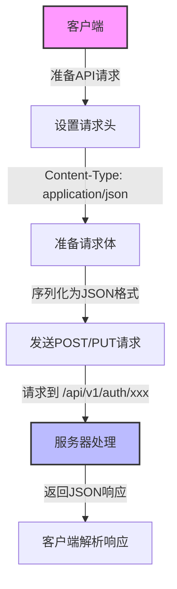
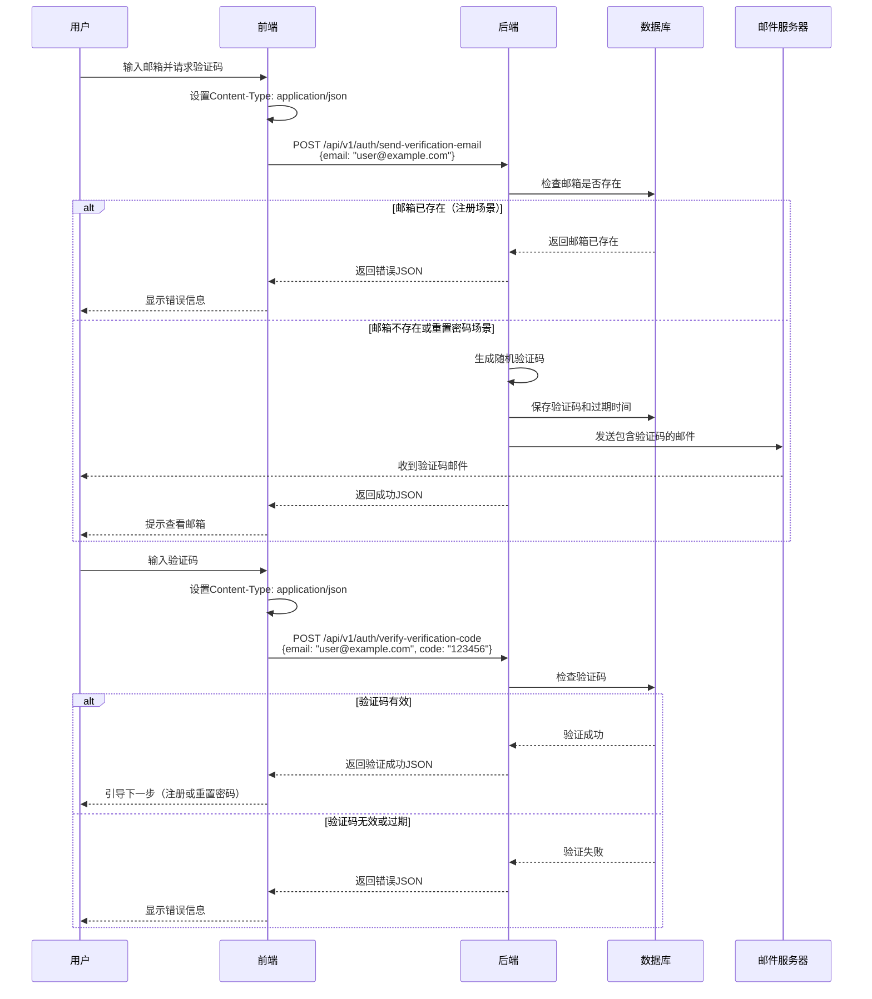
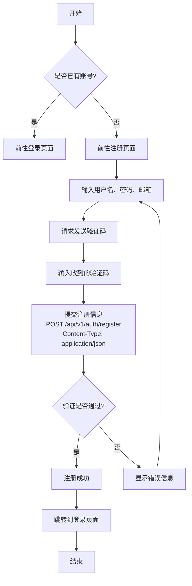
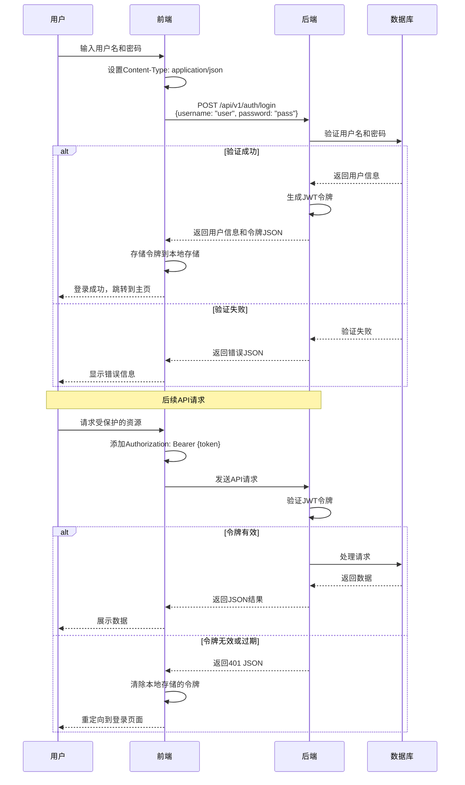
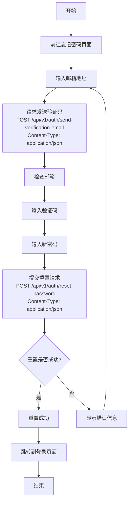

# DeepSeek AI 流程图

## API请求格式

```mermaid
graph TD
    A[客户端] -->|准备API请求| B[设置请求头]
    B -->|"Content-Type: application/json"| C[准备请求体]
    C -->|"序列化为JSON格式"| D[发送POST/PUT请求]
    D -->|"请求到 /api/v1/auth/xxx"| E[服务器处理]
    E -->|"返回JSON响应"| F[客户端解析响应]
    
    style A fill:#f9f,stroke:#333,stroke-width:2px
    style E fill:#bbf,stroke:#333,stroke-width:2px
```

## 用户验证码发送和验证流程

```mermaid
sequenceDiagram
    participant 用户
    participant 前端
    participant 后端
    participant 数据库
    participant 邮件服务器

    用户->>前端: 输入邮箱并请求验证码
    前端->>前端: 设置Content-Type: application/json
    前端->>后端: POST /api/v1/auth/send-verification-email<br/>{email: "user@example.com"}
    后端->>数据库: 检查邮箱是否存在
    
    alt 邮箱已存在（注册场景）
        数据库-->>后端: 返回邮箱已存在
        后端-->>前端: 返回错误JSON
        前端-->>用户: 显示错误信息
    else 邮箱不存在或重置密码场景
        后端->>后端: 生成随机验证码
        后端->>数据库: 保存验证码和过期时间
        后端->>邮件服务器: 发送包含验证码的邮件
        邮件服务器-->>用户: 收到验证码邮件
        后端-->>前端: 返回成功JSON
        前端-->>用户: 提示查看邮箱
    end
    
    用户->>前端: 输入验证码
    前端->>前端: 设置Content-Type: application/json
    前端->>后端: POST /api/v1/auth/verify-verification-code<br/>{email: "user@example.com", code: "123456"}
    后端->>数据库: 检查验证码
    
    alt 验证码有效
        数据库-->>后端: 验证成功
        后端-->>前端: 返回验证成功JSON
        前端-->>用户: 引导下一步（注册或重置密码）
    else 验证码无效或过期
        数据库-->>后端: 验证失败
        后端-->>前端: 返回错误JSON
        前端-->>用户: 显示错误信息
    end
```

## 用户注册流程

```mermaid
flowchart TD
    A[开始] --> B{是否已有账号?}
    B -->|是| C[前往登录页面]
    B -->|否| D[前往注册页面]
    D --> E[输入用户名、密码、邮箱]
    E --> F[请求发送验证码]
    F --> G[输入收到的验证码]
    G --> H["提交注册信息<br/>POST /api/v1/auth/register<br/>Content-Type: application/json"]
    H --> I{验证是否通过?}
    I -->|是| J[注册成功]
    I -->|否| K[显示错误信息]
    K --> E
    J --> L[跳转到登录页面]
    L --> M[结束]
```

## 登录和身份验证流程

```mermaid
sequenceDiagram
    participant 用户
    participant 前端
    participant 后端
    participant 数据库
    
    用户->>前端: 输入用户名和密码
    前端->>前端: 设置Content-Type: application/json
    前端->>后端: POST /api/v1/auth/login<br/>{username: "user", password: "pass"}
    后端->>数据库: 验证用户名和密码
    
    alt 验证成功
        数据库-->>后端: 返回用户信息
        后端->>后端: 生成JWT令牌
        后端-->>前端: 返回用户信息和令牌JSON
        前端->>前端: 存储令牌到本地存储
        前端-->>用户: 登录成功，跳转到主页
    else 验证失败
        数据库-->>后端: 验证失败
        后端-->>前端: 返回错误JSON
        前端-->>用户: 显示错误信息
    end
    
    Note over 用户,后端: 后续API请求
    
    用户->>前端: 请求受保护的资源
    前端->>前端: 添加Authorization: Bearer {token}
    前端->>后端: 发送API请求
    后端->>后端: 验证JWT令牌
    
    alt 令牌有效
        后端->>数据库: 处理请求
        数据库-->>后端: 返回数据
        后端-->>前端: 返回JSON结果
        前端-->>用户: 展示数据
    else 令牌无效或过期
        后端-->>前端: 返回401 JSON
        前端->>前端: 清除本地存储的令牌
        前端-->>用户: 重定向到登录页面
    end
```

## 密码重置流程

```mermaid
flowchart TD
    A[开始] --> B[前往忘记密码页面]
    B --> C[输入邮箱地址]
    C --> D["请求发送验证码<br/>POST /api/v1/auth/send-verification-email<br/>Content-Type: application/json"]
    D --> E[检查邮箱]
    E --> F[输入验证码]
    F --> G[输入新密码]
    G --> H["提交重置请求<br/>POST /api/v1/auth/reset-password<br/>Content-Type: application/json"]
    H --> I{重置是否成功?}
    I -->|是| J[重置成功]
    I -->|否| K[显示错误信息]
    K --> C
    J --> L[跳转到登录页面]
    L --> M[结束]
``` 